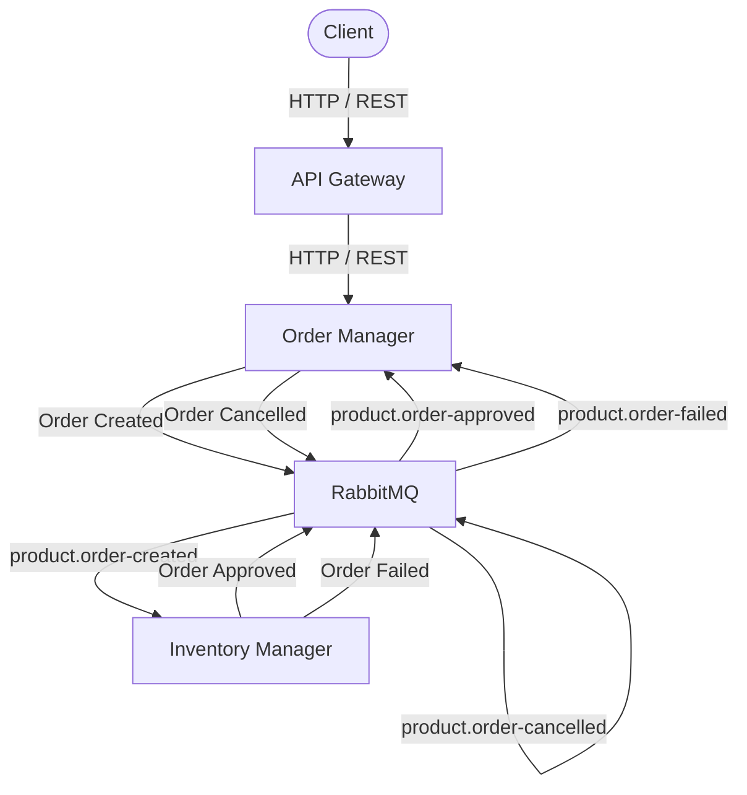
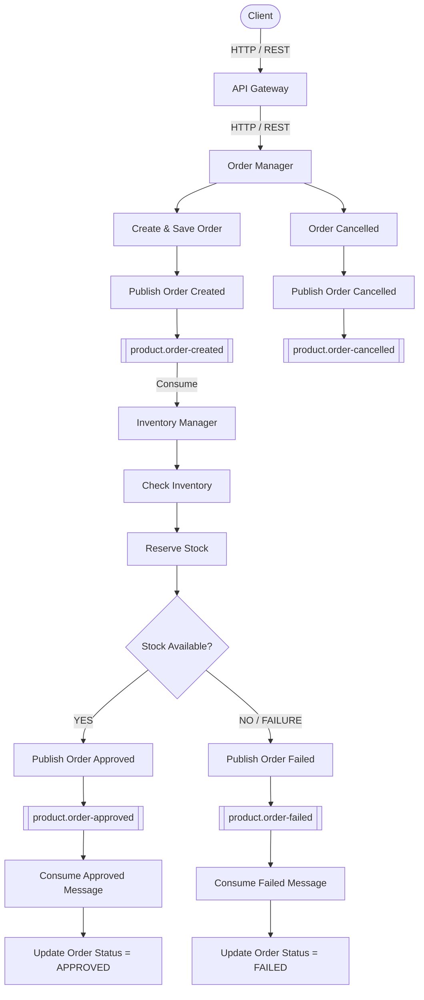

# Flash Sale Microservices

A **.NET 8 microservices backend** for a Flash Sale system built around independent business services, asynchronous messaging, and distributed-system patterns.

## Architecture

The system consists of:

* **API Gateway** — external entry point and request routing
* **Order Manager** — order creation and order lifecycle
* **Inventory Manager** — stock and inventory operations
* **RabbitMQ** — asynchronous communication
* **Redis** — distributed locking
* **SQL Server / Entity Framework Core** — persistence



---

# Program Flow

## 1. Request and Order Creation

```text
Client
   │
   │ HTTP / REST
   ▼
API Gateway
   │
   │ HTTP / REST
   ▼
Order Manager
   │
   ├── Create Order
   ├── Save Order
   └── Publish Order Created Event
                │
                ▼
             RabbitMQ
                │
                ▼
      product.order-created
                │
                ▼
        Inventory Manager
```

The `product.order-created` message is consumed by the Inventory Manager.

---

## 2. Inventory Processing

After consuming the order-created message, Inventory Manager:

```text
Consume Order Created Message
            │
            ▼
      Check Inventory
            │
            ▼
       Reserve Stock
            │
            ▼
      Stock Available?
```

### Approved

When stock is successfully reserved:

```text
Inventory Manager
        │
        ▼
Reserve Stock Successfully
        │
        ▼
Publish Order Approved
        │
        ▼
RabbitMQ
        │
        ▼
product.order-approved
        │
        ▼
Order Manager
        │
        ▼
Consume Order Approved
        │
        ▼
Update Order Status = APPROVED
```

### Failed

When the inventory operation fails:

```text
Inventory Manager
        │
        ▼
Publish Order Failed
        │
        ▼
RabbitMQ
        │
        ▼
product.order-failed
        │
        ▼
Order Manager
        │
        ▼
Consume Order Failed
        │
        ▼
Update Order Status = FAILED
```

### Releasing Reserved Stock

When an existing reservation needs to be reverted:

```text
Release Reserved Stock
        │
        ▼
Update Inventory
```

---

# Order Cancellation

The Order Manager can publish an order-cancelled event:

```text
Order Manager
      │
      ▼
Order Cancelled
      │
      ▼
Publish Order Cancelled Event
      │
      ▼
RabbitMQ
      │
      ▼
product.order-cancelled
```

---

# RabbitMQ Queues

RabbitMQ currently contains **8 queues**.

| Main Queue                | Dead Letter Queue             |
| ------------------------- | ----------------------------- |
| `product.order-created`   | `product.order-created.dlq`   |
| `product.order-approved`  | `product.order-approved.dlq`  |
| `product.order-failed`    | `product.order-failed.dlq`    |
| `product.order-cancelled` | `product.order-cancelled.dlq` |

## Dead Letter Queues

The `.dlq` queues are **failure paths**, not part of the normal business flow.

A message follows:

```text
Main Queue
    │
    ▼
Consumer
    │
    ├── Success → Business Operation
    │
    └── Processing Failure
               │
               ▼
              DLQ
```

For example:

```text
product.order-created
        │
        │ Message Processing Failed
        ▼
product.order-created.dlq
```

The same pattern applies to the other three queue pairs.

---

# Communication

### Synchronous

Used between the client, Gateway, and backend API:

```text
Client
  │
  │ HTTP / REST
  ▼
API Gateway
  │
  │ HTTP / REST
  ▼
Order Manager
```

### Asynchronous

Used between Order Manager and Inventory Manager through RabbitMQ:

```text
Order Manager
      │
      ▼
   RabbitMQ
      │
      ▼
Inventory Manager
```

The services communicate through events rather than direct synchronous calls for these workflows.

---

# Outbox Pattern

The Order Manager uses the **Outbox Pattern** for outgoing messages.

```text
Order Manager
      │
      ├── Save Order
      │
      └── Save Outbox Message
                │
                ▼
          Outbox Storage
                │
                ▼
         Publish Message
                │
                ▼
             RabbitMQ
```

Relevant components include:

```text
OutBoxMessage.cs
IOutboxRepository.cs
OutBoxRepository.cs
OrderCreatedPublisher.cs
OrderCancelledPublisher.cs
```

---

# Redis Distributed Lock

Redis is used for distributed locking when operations require synchronization across service instances.

```text
Order Manager ──────┐
                    ▼
                  Redis
                    ▲
Inventory Manager ──┘
```

---

# Service Architecture

The Order and Inventory services use a layered architecture:

```text
API
 │
 ▼
Application
 │
 ▼
Domain
 │
 ▼
Infrastructure
```

### API

Handles HTTP endpoints, middleware, and service configuration.

### Application

Contains application services, DTOs, interfaces, messaging contracts, publishers, and consumers.

### Domain

Contains the core business models and enums.

### Infrastructure

Contains database access, repositories, RabbitMQ, Redis, and other external infrastructure implementations.

---

# Order Manager

The Order Manager owns the order domain and contains:

* Order creation
* Order status management
* Order event publishing
* Inventory result consumers
* Outbox processing
* Distributed locking

Messaging components include:

```text
Messaging/
├── Consumers/
│   ├── OrderApprovedConsumer.cs
│   └── OrderFailedConsumer.cs
│
├── Messages/
│   ├── IOrderMessage.cs
│   ├── OrderCreatedMessage.cs
│   └── OrderCreatedProduct.cs
│
├── Publishers/
│   └── OrderPublisher.cs
│
└── OutBox/
    ├── OrderCreatedPublisher.cs
    └── OrderCancelledPublisher.cs
```

---

# Inventory Manager

The Inventory Manager owns inventory and stock operations.

Its responsibilities include:

* Checking inventory
* Reserving stock
* Releasing reserved stock
* Processing order-created messages
* Publishing order results

Messaging components include:

```text
Messaging/
├── Consumers/
│   └── OrderCreatedConsumer.cs
│
└── Publishers/
    └── InventoryPublisher.cs
```

---

# Project Structure

```text
Flash Sale/
│
├── FlashSale.InventoryManager.API/
│   ├── FlashSale.InventoryManager.API/
│   ├── FlashSale.InventoryManager.Application/
│   ├── FlashSale.InventoryManager.Domain/
│   └── FlashSale.InventoryManager.Infrastructure/
│
├── FlashSale.OrderManager.API/
│   ├── FlashSale.OrderManager.API/
│   ├── FlashSale.OrderManager.Application/
│   ├── FlashSale.OrderManager.Domain/
│   └── FlashSale.OrderManager.Infrastructure/
│
└── GateWay/
    ├── GateWay/
    ├── Gateway.Application/
    └── Gateway.Domain/
```

---

# Technology Stack

| Technology                | Purpose                |
| ------------------------- | ---------------------- |
| **.NET 8**                | Backend platform       |
| **ASP.NET Core**          | Web APIs               |
| **C#**                    | Programming language   |
| **Entity Framework Core** | Data access            |
| **SQL Server**            | Persistence            |
| **RabbitMQ**              | Asynchronous messaging |
| **Redis**                 | Distributed locking    |
| **AutoMapper**            | Object mapping         |
| **Swagger / OpenAPI**     | API documentation      |
| **Git / GitHub**          | Source control         |

---

# End-to-End Flow



### Flow Summary

```text
Client
  │
  ▼
API Gateway
  │
  ▼
Order Manager
  │
  ├── Create & Save Order
  │
  ├── Publish Order Created
  │        │
  │        ▼
  │   product.order-created
  │        │
  │        ▼
  │   Inventory Manager
  │        │
  │   Check Inventory
  │        │
  │   Reserve Stock
  │        │
  │    ┌───┴─────────────┐
  │    │                 │
  │  YES                 NO
  │    │                 │
  │    ▼                 ▼
  │  Order              Order
  │  Approved            Failed
  │    │                 │
  │    ▼                 ▼
  │ product.            product.
  │ order-approved      order-failed
  │    │                 │
  │    ▼                 ▼
  │ Order Manager     Order Manager
  │    │                 │
  │    ▼                 ▼
  │ Update Status      Update Status
  │ = APPROVED         = FAILED
  │
  └── Order Cancelled
           │
           ▼
     Publish Order Cancelled
           │
           ▼
     product.order-cancelled
```


---

# Key Patterns

* **Microservices Architecture** — separates Order and Inventory responsibilities.
* **API Gateway** — provides a single entry point for clients.
* **Event-Driven Communication** — RabbitMQ connects the Order and Inventory workflows asynchronously.
* **Outbox Pattern** — improves reliability of outgoing events.
* **Distributed Locking** — Redis coordinates concurrent operations.
* **Dead Letter Queues** — isolate messages that fail processing.

---

# Current Status

* [x] API Gateway
* [x] Order Manager
* [x] Inventory Manager
* [x] HTTP / REST communication
* [x] RabbitMQ messaging
* [x] Order Created event
* [x] Order Approved event
* [x] Order Failed event
* [x] Order Cancelled event
* [x] Dead Letter Queues
* [x] Outbox Pattern
* [x] Redis Distributed Lock
* [x] Entity Framework Core
* [x] SQL Server persistence
* [x] Layered architecture
